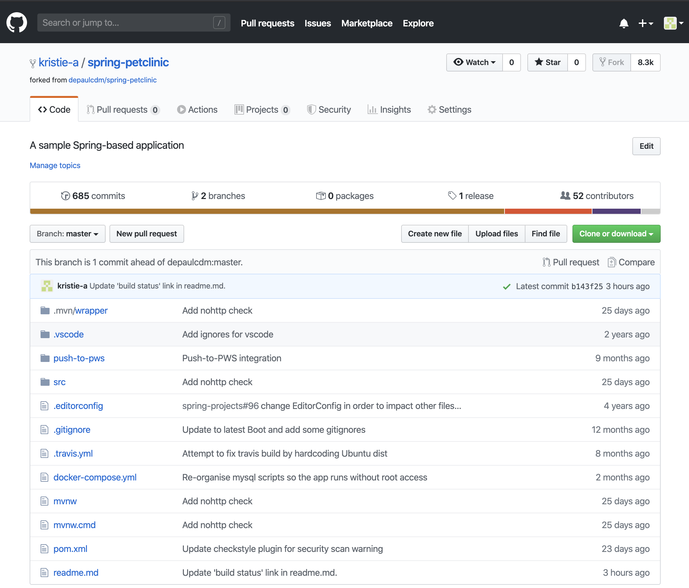
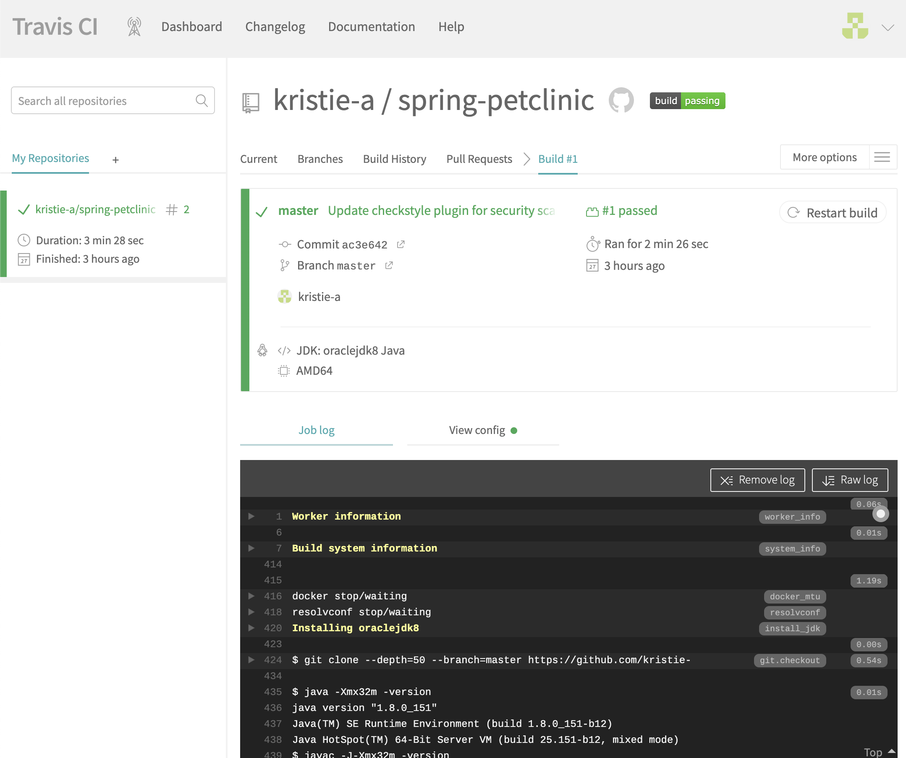
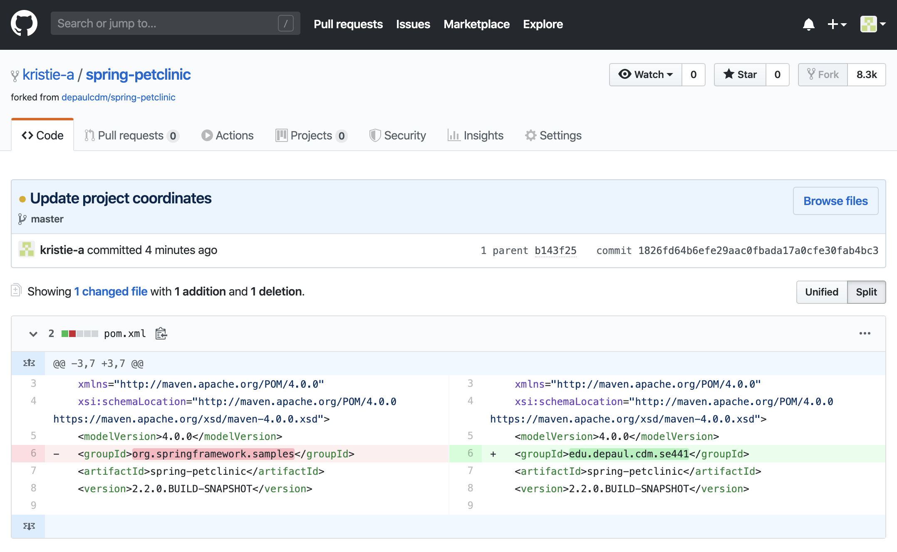
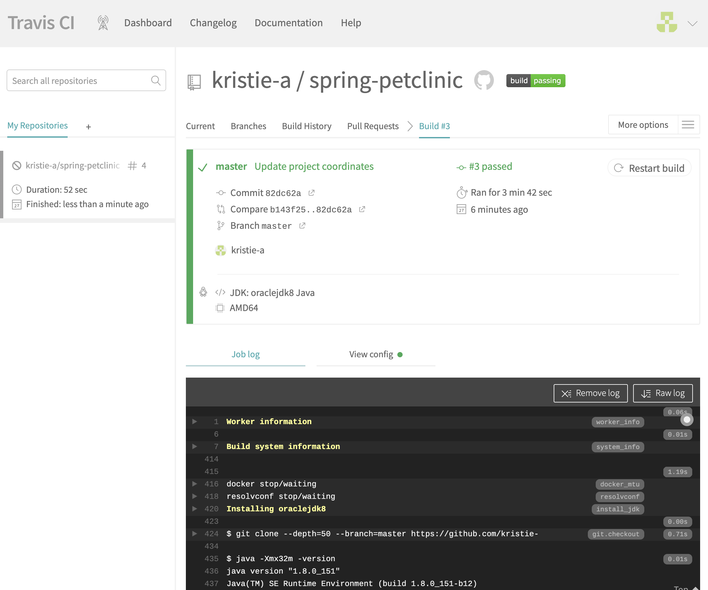
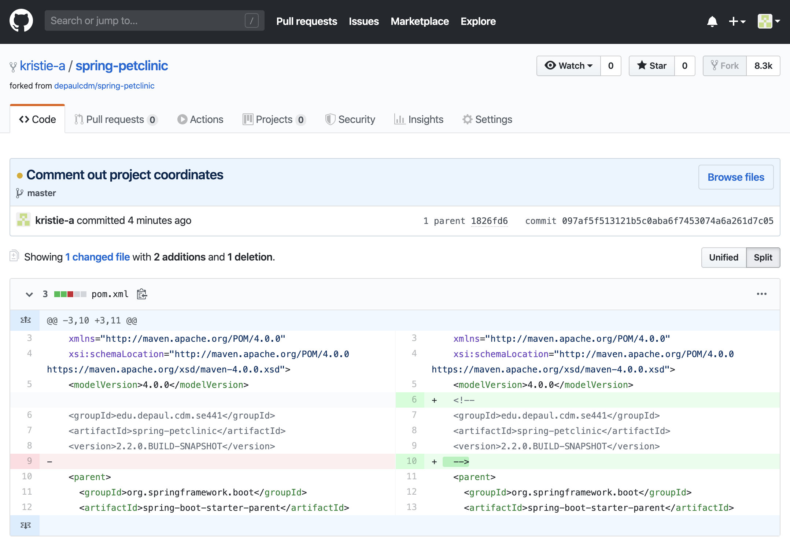
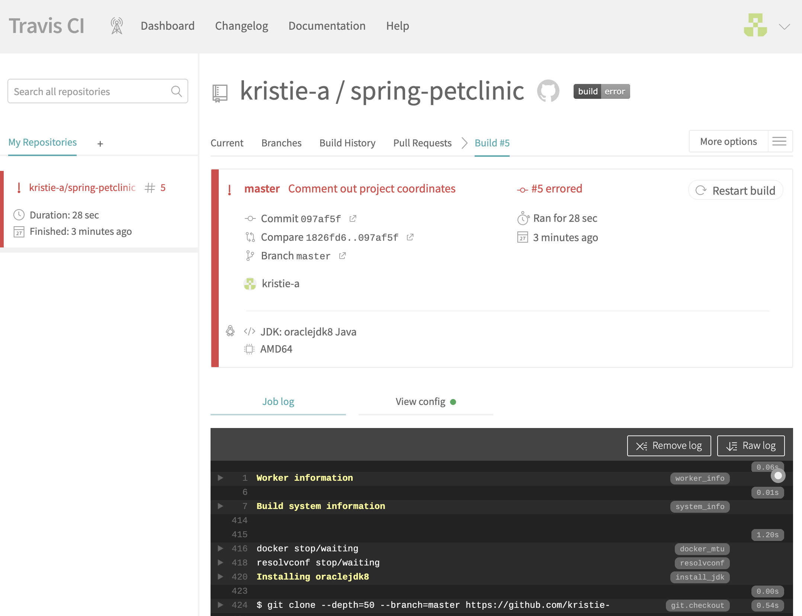
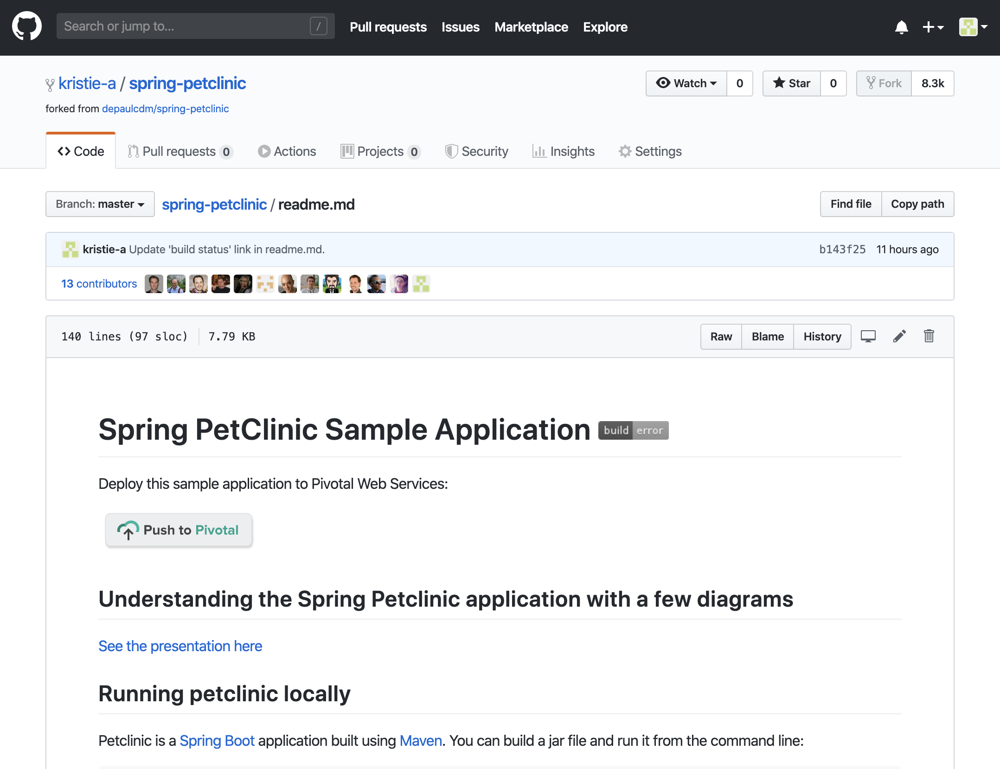
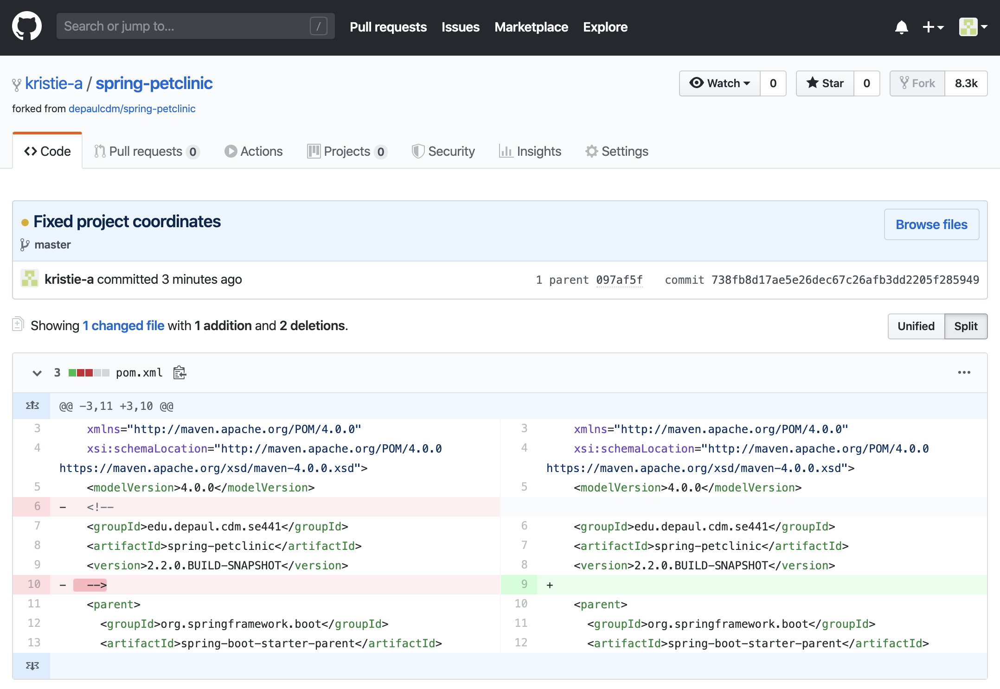
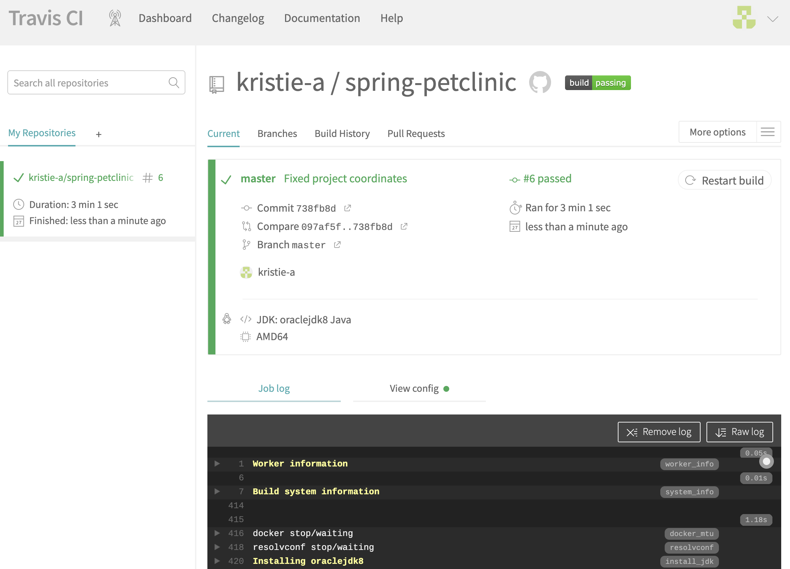
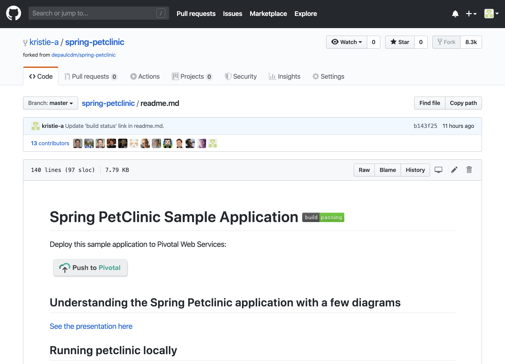

# Github Forked

# Travis CI First Successful Build

# POM.xml Update Coordinates

# Travis CI Successful Build After Update

# POM.xml Comment Out Coordinates

# Travis CI Broken Build

# Github readme.md Build Error Status

# POM.xml Fixed

# Travis CI Successful Build After Fix

# Github readme.md Build Success Status
